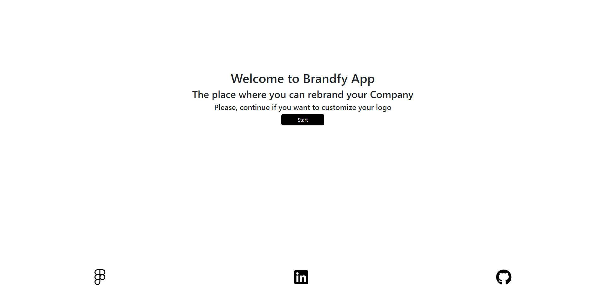
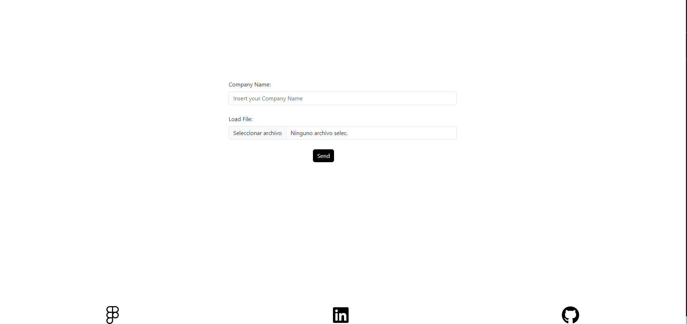
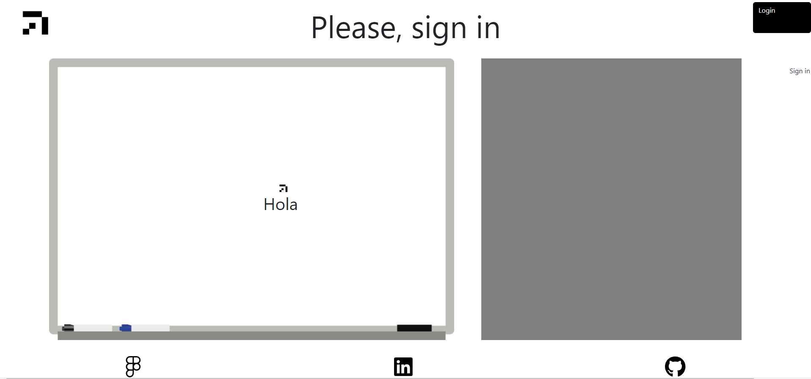

# MERN Brandfy App

This is a web application developed using the MERN stack (MongoDB, Express.js, React.js, and Node.js) along with Amazon S3 for file storage. The application allows users to upload, modify, and manage the size, shape, and name of their company logos. Additionally, it provides a private area where users can access and view previously saved logos along with the applied characteristics.

## Table of Contents

- [Features](#features)
- [Responsive](#responsive)
- [Tech Stack](#teck-stack)
- [Getting Started](#getting-started)
- [Folder Structure](#folder-structure)
- [Contributing](#contributing)
- [License](#license)

## APP




## Features
- Logo Management: Users can upload and modify the size and shape of their company logos.

- Editing Company Name: Users have the ability to edit the name of their companies associated with each logo.

- Amazon S3 Storage: The application utilizes Amazon S3 for file storage, ensuring secure and scalable management of logos.

- Private Area: The application has a private area where users can access and view their previously saved logos, along with the applied characteristics.


## Tech Stack
- MongoDB: NoSQL database for storing data securely.

- Express.js: Backend framework to handle server-side logic and API endpoints.

- React: Frontend library for building a dynamic and responsive user interface.

- Node.js: JavaScript runtime for server-side development.

- Amazon S3 Storage: Storage bucket to save your images.


## Getting Started

Follow these steps to get the project up and running on your local machine.

1. **Clone the repository**:
    ```bash
       git clone https://github.com/franpalberca/brandfy-project

Install dependencies:

Navigate to the client folder and run npm install to install client dependencies.
Navigate to the server folder and run npm install to install server dependencies.
Configure the necessary environment variables for connecting to the MongoDB database and Amazon S3.
Run the server with npm start in the client folder.
Run the server with npm start in the server folder.
Access the application through the web browser using the URL provided by the client

2. **Set up Environment Variable**:

Create a .env file at the root of your client folder and add all env variables:
VITE_API_URL=
VITE_API_URL_USER=
VITE_AUTH0_AUDIENCE=
VITE_API_URL_DATA=

Create a .env file at the root of your server folder and add all env variables:
APP_ORIGIN=
MONGO_DB_URI=
PORT=

#AWS
BUCKET_NAME=
ACCESS_KEY_ID=
SECRET_ACCESS_KEY=
REGION=

3. **Start the development server**:
    ```bash
    npm run dev

4. **Open your browser**:

Open your web browser and visit http://localhost:5173 to see the app.

## Folder Structure
The project's folder structure is organized as follows:
src/: Contains the application's source code, organized into components and styles.
package.json: Contains all the dependencies and dev dependencies.
.env: Environment variable file to store your GitHub personal access token.

## Contributing
Contributions are welcome! Feel free to open issues or pull requests.

## License
This project is free of license and it's use is purely academical.
